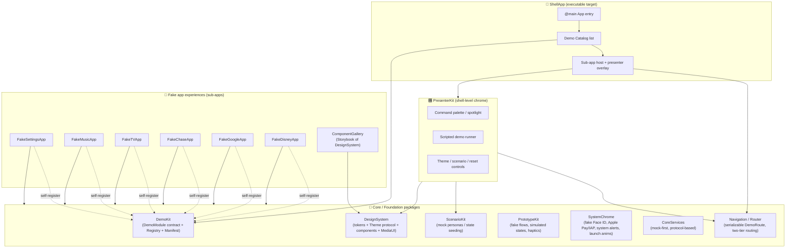
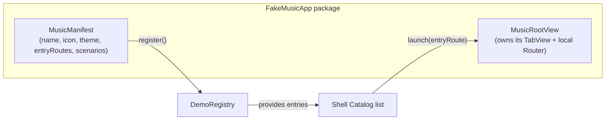
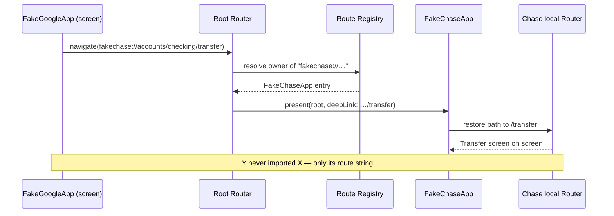
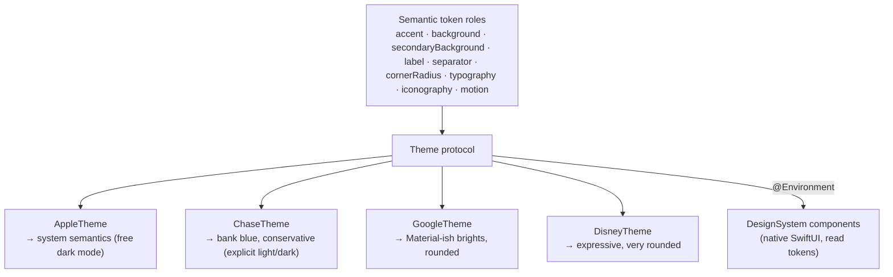
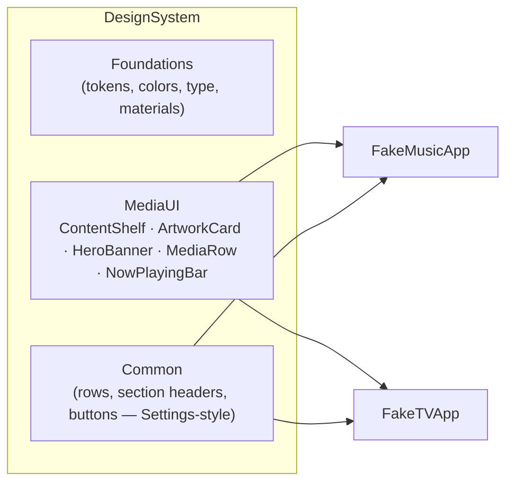
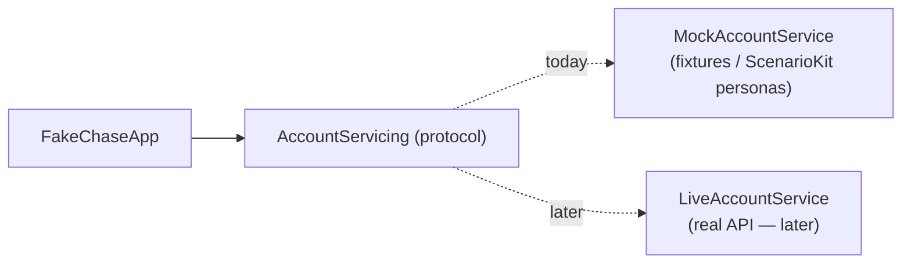
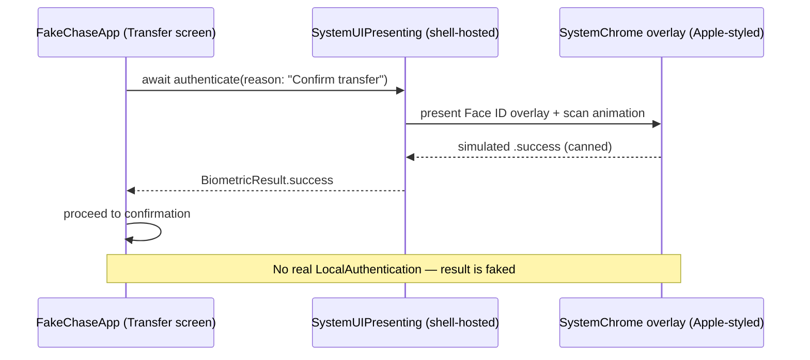
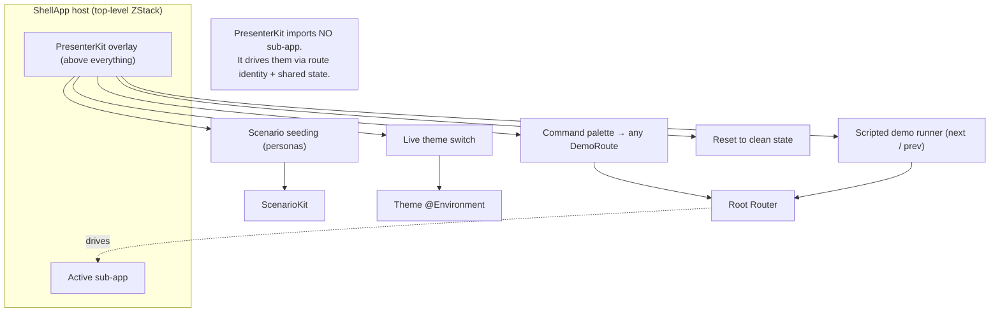
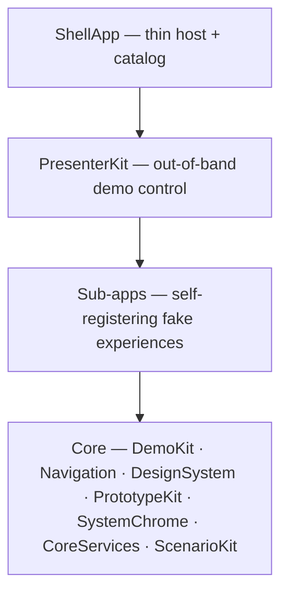

# Shell Demo App — Architecture

A modular iOS **shell app** that hosts multiple self-contained **fake app experiences**
("sub-apps") for **high-fidelity wireframe prototyping**. It demonstrates *experiences*
with interactive-but-fake UI rather than delivering real functionality — with a clean
seam to layer real functionality in later.

- **UI:** SwiftUI, native components, adhering to Apple Human Interface Guidelines (HIG)
- **Structure:** Swift Package Manager (SPM) local packages — one per module/sub-app
- **Target:** iOS Simulator-first (no device-only APIs in the core path)
- **Themable:** one shared component library skinned per brand (Apple, Chase, Google, Disney, …)
- **Presenter-driven:** an out-of-band control layer lets the demo presenter navigate everything

---

## 1. Design goals

| Goal | How the architecture delivers it |
|------|----------------------------------|
| **Modular** | Every module and sub-app is its own SPM package with enforced boundaries |
| **Reusable UI** | One `DesignSystem` component library, consumed by every sub-app |
| **Navigable catalog** | Shell reads a registry of self-registering sub-apps; no shell edits to add one |
| **Cross-linking (launch X from Y)** | Central Router with serializable routes; features never import each other |
| **Sub-apps, not screens** | Each sub-app is a mini-shell with its own internal features + navigation |
| **Apple look & feel** | Native SwiftUI + HIG; `AppleTheme` maps tokens to system semantics |
| **Third-party look & feel** | Pluggable `Theme`s (Chase, Google, Disney…) skin the same native components |
| **Prototype now, real later** | Services are mock-first behind protocols; swap implementations later |
| **Presenter control** | `PresenterKit` overlay drives the Router + state from outside the sub-apps |
| **Extensible** | Routes and state are declarative data; sub-apps self-register via manifests |

**Dependency rule (the one rule that keeps it modular):**
Sub-apps depend **only** on Core modules. A sub-app **never** imports another sub-app.
All arrows point inward toward Core. Cross-app navigation goes through the Router by
*route identity*, never by a direct type reference.

---

## 2. Module map



> **Read the arrows:** every sub-app points *into* Core. No sub-app points at another
> sub-app. That single constraint is what makes the whole thing modular.

---

## 3. Module responsibilities

| Module | Kind | Responsibility |
|--------|------|----------------|
| **ShellApp** | App target | `@main` entry, demo catalog list, hosts the selected sub-app + presenter overlay. Owns no feature logic. |
| **DemoKit** | Core lib | The `DemoModule` contract, the `DemoRegistry`, and per-sub-app `Manifest` (name, icon, theme, routes, scenarios). |
| **Navigation** | Core lib | Serializable `DemoRoute` model + two-tier `Router` (shell↔sub-app and screen↔screen). Deep links + cross-links. |
| **DesignSystem** | Core lib | Semantic **tokens**, the `Theme` protocol + concrete themes, native-composed **components**, and the shared **MediaUI** cluster. |
| **PrototypeKit** | Core lib | Interactive illusion at the *app* level: fake auth flows, simulated loading, canned transitions, haptics — no real logic. |
| **SystemChrome** | Core lib | Fake reproductions of *iOS system* surfaces (Face ID, Apple Pay/IAP, alerts, permission prompts, launch animations). Always Apple-styled; simulated results only. |
| **CoreServices** | Core lib | Data behind **protocols** with mock/fixture implementations today, real implementations later. |
| **ScenarioKit** | Core lib | Named mock personas / fixture sets that seed the whole app into a known state. |
| **PresenterKit** | Shell chrome | Presenter overlay: command palette, scripted runs, theme/scenario/reset controls. Drives Router + state from outside the sub-apps. |
| **Fake*App** | Feature pkgs | Self-contained experiences, each with its own internal features + navigation. |
| **ComponentGallery** | Feature pkg | A "Storybook" of every DesignSystem component across all themes. |

---

## 4. The DemoModule contract (self-registration)

Each sub-app is agnostic to the shell. It exposes one entry point and a manifest;
the shell iterates the registry to build the catalog — **adding a sub-app never
edits shell code.**



Because a sub-app hands the shell only a *root view*, it can root **any** navigation
style internally — `NavigationStack` (Settings-style push) or `TabView` (Music-style) —
and the shell doesn't care whether it has 1 screen or 40.

---

## 5. Navigation: declarative, addressable routes (two tiers)

The spine of the whole design: **every screen in every app is nameable as data.**
A `DemoRoute` is a serializable value — a URL-like address.

```
fakemusic://library/playlist/42
fakechase://accounts/checking/transfer/confirm
fakesettings://display/appearance
faketv://show/1234/episode/7
```

From this one decision, everything else falls out for free:

- ✅ **Cross-app links** — "launch X from Y" is just resolving X's address
- ✅ **Presenter command palette** — jump to any address in any app
- ✅ **Scripted demos** — a demo is an ordered list of addresses + state
- ✅ **Real deep links / QR codes** into a demo, later
- ✅ **State restoration & UI testing**



**Two-tier routing:**
- **Root Router** — shell ↔ sub-apps, and cross-app jumps.
- **Local Router** — screen ↔ screen *inside* a sub-app.

A deep cross-link is just: `Y local → Root Router → X entry → X local → target screen`.

---

## 6. Theming: one component library, many brands

Components never hardcode colors. They read **semantic token roles** from a `Theme`
injected via SwiftUI `@Environment`. Each sub-app declares its theme at its root;
everything inside inherits it.



- **AppleTheme** maps tokens straight to system semantics (`Color(.systemBackground)`,
  `.tint`, SF Symbols) → free dark mode. Used by Fake Settings / Music / TV.
- **Brand themes** map tokens to brand values with **explicit light + dark variants**.
- **Adding a brand = adding one `Theme`. Zero component changes.**

**Honest boundary:** themes make native components *evoke* a brand; they don't
pixel-clone a full cross-platform design system (e.g. true Material). Any genuinely
bespoke brand element lives inside its own sub-app, not in shared code.

**Token axes** (so brands can differ in more than color):

| Axis | Apple | Chase | Google | Disney |
|------|-------|-------|--------|--------|
| Color | system semantics | bank blue | Material brights | brand purple/blue |
| Typography | SF / Dynamic Type | brand-ish | Roboto-like | expressive |
| Shape (radius) | modest | modest | rounded | very rounded |
| Iconography | SF Symbols | brand marks | Material-ish | brand marks |
| Motion | standard | standard | springy | expressive |

---

## 7. Reusable UI: MediaUI shared across sub-apps

Fake Music and Fake TV share a whole cluster of media components — the concrete proof
of "reusable across different elements." The **same** components render Apple-flavored
or brand-flavored depending on the injected theme.



**Persistent chrome (now-playing):** Apple Music's mini-player persists across tabs and
expands into a sheet — a cross-cutting overlay that outlives normal navigation. It's
hosted by the sub-app above its `TabView`, driven by shared playback state, and is a
natural cross-link demo (tap a track in Fake TV → routes into Fake Music's player).

---

## 8. Services: mock-first, real later

The seam that future-proofs the prototype. Sub-apps depend on a **protocol**, not an
implementation.



Swapping `Mock` → `Live` requires **zero UI changes**. `ScenarioKit` chooses *which*
fixtures the mock returns ("account healthy" vs "overdrawn", "new user" vs "power user").

---

## 9. System-level fidelity — SystemChrome

Fake reproductions of the surfaces **iOS itself owns** — presented *above* the app UI to
sell the illusion that these are real installed apps. This is separate from `PrototypeKit`
(which fakes *app-level* flows); `SystemChrome` fakes the *system*.

| Surface | What it mimics |
|---------|----------------|
| **Biometric auth** | Face ID / Touch ID scanning overlay → success / fail / fallback-to-passcode |
| **Payment** | Apple Pay sheet, In-App Purchase confirmation ("double-click to confirm" side-button hint) |
| **System dialogs** | Alerts, action sheets, permission prompts (notifications, App Tracking Transparency, camera, location, contacts) |
| **Banners & warnings** | Notification banners, system toasts, error/warning states |
| **App lifecycle** | Launch splash + icon-zoom open animation, close/backgrounding transitions |

**Two rules that keep it faithful:**

1. **System chrome is always Apple-styled — even inside a brand app.** On a real iPhone the
   Face ID sheet looks identical in Chase or Disney, so `SystemChrome` **ignores the
   sub-app's brand theme** and renders with system semantics. (In-app UI is brand-themed;
   system UI is not — this contrast is what reads as authentic.)
2. **Presented via a shell-hosted `SystemUIPresenting` service** any sub-app can `await`:



> **Guardrail (do not violate):** these are **non-functional visual simulations for
> prototyping only.** They never collect real credentials, biometrics, or payment, and are
> never wired to real `LocalAuthentication`, `StoreKit`, or any backend. Keeping them fake
> is what keeps the prototype legitimate.

---

## 10. Presenter Control Layer

Shell-level chrome the **presenter** drives — invisible to the audience until summoned,
and completely outside the fake apps.



- **Invocation:** multiple triggers for Simulator + device reliability — hidden corner
  tap **+** keyboard shortcut **+** shake (`⌃⌘Z` in Simulator).
- **Decoupling:** talks only to the Router and shared state; sub-apps don't know they're
  being remotely driven.

---

## 11. Simulator compatibility

Everything runs in the iOS Simulator; it's the primary target. Caveats are minor:

| Thing | In Simulator | Design response |
|-------|-------------|-----------------|
| Haptics | Silent no-op | Enhancement only, never the signal; feel on device |
| Presenter gesture | Shake works; 3-finger tap fiddly | Offer multiple triggers (corner tap + shortcut + shake) |
| Real media | N/A (wireframes) | Now-playing is UI state + placeholder artwork |
| Face ID / camera / push | Simulated / unavailable | Not needed; fake in PrototypeKit |

Use Xcode's **Environment Overrides** to demo light/dark, Dynamic Type, and accessibility
against the theme system.

---

## 12. Layer summary



The shell is a thin host. Because **routes and state are declarative data** and
**sub-apps self-register via manifests**, a presenter can drive the entire universe of
fake apps from an overlay that never touches their code — and new fake apps, new themes,
and (later) real functionality all drop in without a rewrite.

See **[docs/BUILD_PLAN.md](docs/BUILD_PLAN.md)** for the SPM layout, contract sketches,
and the phased implementation order.
